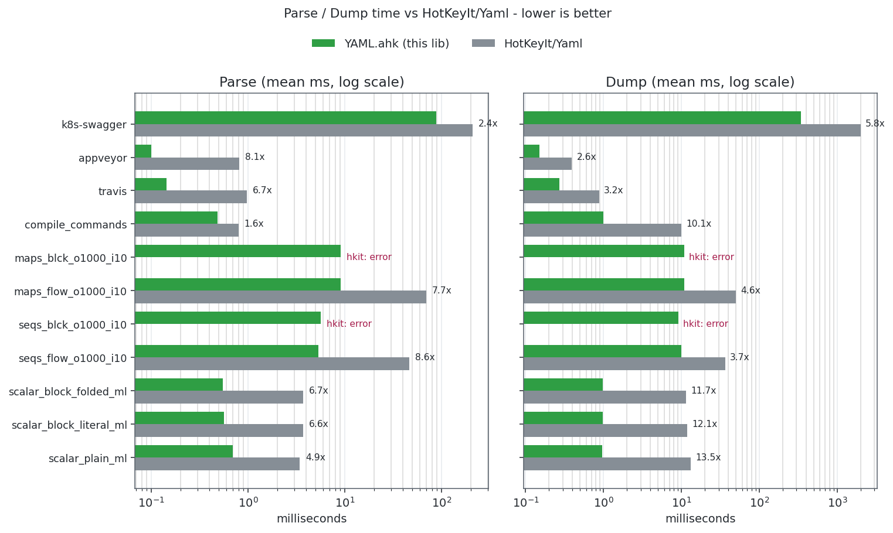
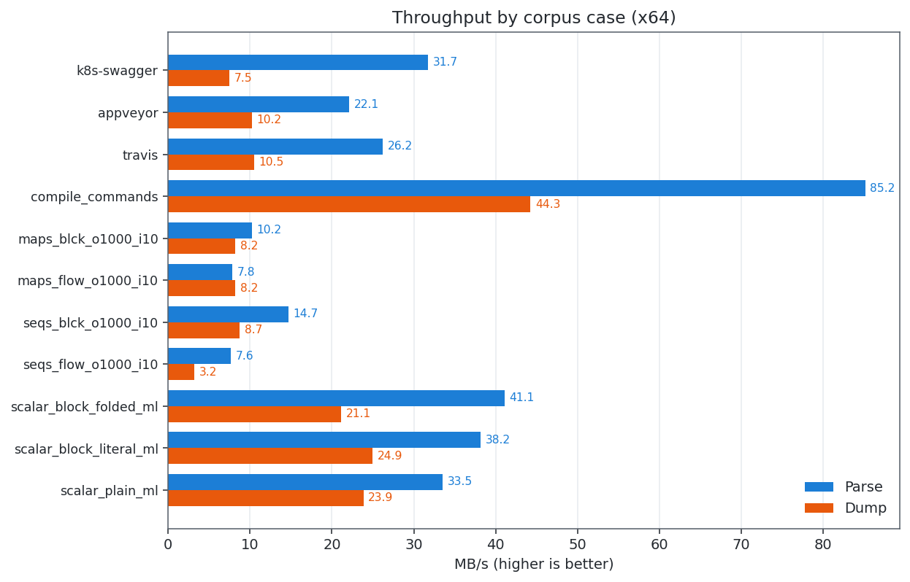

# YAML for AutoHotkey

A YAML 1.1 loader and emitter for AutoHotkey v2, powered by [`libyaml`] embedded via [`MCL`]. Inspired by (read: shamelessly looking over the shoulder of) [`cJSON`]. 2-13x faster than [`HotKeyIt/YAML`], with wider gaps on dump and parsing of small inputs - see [Performance](#performance).

[`libyaml`]: https://pyyaml.org/wiki/LibYAML
[`MCL`]: https://github.com/G33kDude/MCL.ahk
[`cJSON`]: https://github.com/G33kDude/cJson.ahk
[`HotKeyIt/YAML`]: https://github.com/HotKeyIt/Yaml

<details>
<summary><b>Table of Contents</b></summary>

- [Install](#install)
- [Quick start](#quick-start)
- [APIs](#apis)
  - [Parsing](#parsing)
  - [Dumping](#dumping)
  - [Options](#options)
- [Type Mappings](#type-mappings)
  - [Explicit Tags](#explicit-tags)
  - [Serializing Autohotkey Objects](#serializing-autohotkey-objects)
- [Performance](#performance)
- [Limitations](#limitations)
- [License](#license)

</details>

## Install

Grab a copy of `YAML.ahk` off the [Releases] page, drop it into your project or a [library folder], and include it:

```ahk
#Requires AutoHotkey v2.0
#Include <YAML>
```

The single file includes both 32-bit and 64-bit machine-code blobs and selects the right one at load time. If you know the bitness of your interpreter ahead of time, you can `#Include` either `Yaml32.ahk` or `Yaml64.ahk` to reduce the size of your script. The exported class is still called `Yaml` in all files.

[library folder]: https://www.autohotkey.com/docs/v2/Scripts.htm#lib
[Releases]: https://github.com/holy-tao/YAML/releases/latest

## Quick start

```ahk
#Include <YAML>

config := YAML.Parse('
(
name: my-app
version: 1.2.3
features:
  - logging
  - metrics
limits:
  timeout: 30
  retries: 3
)')

MsgBox(config["name"])                ; my-app
MsgBox(config["features"][1])         ; logging
MsgBox(config["limits"]["timeout"])   ; 30

; Round-trip
text := YAML.Dump(config, pretty := true)
FileAppend(text, "config.yml")
```

## APIs

Values can be de/serialized to and from strings or files. All APIs are static to the `Yaml` class.

> [!Note]
> It is faster to use the `YAML.*File` methods when working with files, as this uses LibYAML's `FILE*`-based functionality and avoids reading entire file contents into memory and copying these potentially large strings between AHK function calls. Ensure you've opened the files in question with the proper permissions.

### Parsing
| Method | Purpose |
| --- | --- |
| `YAML.Parse(str)` | Parse a single-document YAML string. Throws `YAMLMultiDocError` if the stream has more than one document. |
| `YAML.ParseAll(str)` | Parse a multi-document stream into an `Array` of values. |
| `YAML.ParseFile(file)` | Parse the contents of a file, identified by either an AHK [File Object], a path, or a Win32 [`HANDLE`]. |
| `YAML.ParseAllFile(file)` | Parse the contents of a multi-document file, identified by either an AHK [File Object], a path, or a Win32 [`HANDLE`]. |

### Dumping
| Method | Purpose |
| --- | --- |
| `YAML.Dump(val, pretty := 0)` | Serialize a value to a YAML string. |
| `YAML.DumpAll(docs, pretty := 0)` | Serialize an `Array` of values as a multi-document stream. |
| `YAML.DumpFile(file, pretty := 0,)` | Serialize a value to a file, identified by either an AHK [File Object], a path, or a Win32 [`HANDLE`]. |
| `YAML.DumpAllFile(file, pretty := 0,)` | Serialize an `Array` of values to a file, identified by either an AHK [File Object], a path, or a Win32 [`HANDLE`]. |

The `pretty` option currently just sets the maximum width of the final document to 80 characters, but may be expanded in the future to include more formatting options. 

[File Object]: https://www.autohotkey.com/docs/v2/lib/File.htm
[`HANDLE`]: https://learn.microsoft.com/en-us/windows/win32/sysinfo/handles-and-objects

### Options

All flags are static properties on `YAML`:

| Property | Default | Effect |
| --- | --- | --- |
| `YAML.NullsAsStrings` | `true` | When false, `null` decodes to `YAML.Null` instead of `''`. |
| `YAML.BoolsAsInts` | `true` | When false, booleans decode to `YAML.True` / `YAML.False` sentinels. |
| `YAML.ResolveMergeKeys` | `true` | When false, the YAML 1.1 [merge key] (`<<`) is kept as a literal key instead of splicing. |
| `YAML.ImplicitBools` | `true` | When false, only YAML 1.2 booleans (`true`/`false` and case variants) parse as bools; `yes`/`no`/`on`/`off` stay strings. This allows you to work around the [norway problem], at the cost of strict 1.1 spec compliance.|
| `YAML.StrictTags` | `true` | When true, `YAML.Parse` throws an error if it encounters an [ahk object tag] which cannot be resolved. When false, these values are deserialized as if they were untagged. |

[merge key]: https://yaml.org/type/merge.html
[norway problem]: https://news.ycombinator.com/item?id=36745212
[ahk object tag]: #serializing-autohotkey-objects

## Type Mappings

For the most part, YAML primitives map cleanly to AutoHotkey primitives and vice versa. YAML mappings map to `Map` objects, YAML arrays map to `Array` objects. Like [`cJSON`](https://github.com/G33kDude/cJson.ahk),  `YAML` can also parse boolean and null values into sentinel objects (see [options](#options)), otherwise they are Integers and empty strings respectively.

| YAML | AHK |
| --- | --- |
| mapping | `Map` |
| sequence | `Array` |
| string | `String` |
| int / float | numeric primitive |
| `true` / `false` | `1` / `0` (or `YAML.True` / `YAML.False`) |
| `null` / `~` / empty | `''` (or `YAML.Null`) |

[Anchors and aliases] (`&name` / `*name`) are resolved to shared references - mutating through one alias is visible through the others. Recursive anchors produce self-referential containers. When dumping, `YAML` will detect references to objects in the graph and dump them as anchors, preserving the graph. This behavior is not currently configurable.

When dumping objects, empty strings and the integers `1` and `0` have no special meaning, they're dumped as strings and numbers. If you want explicit YAML `null` or boolean values, you must use the sentinels described below.

[anchors and aliases]: https://yaml.org/spec/1.2.2/#3222-anchors-and-aliases

### Explicit [Tag]s

`YAML.ahk` supports the following [explicit tags], which bypass the data type inference logic. `YAML.ahk` also supports the more verbose tag uri format (`tag:yaml.org,2002:str` and so forth):
- `!!str`: Indicates a string value
- `!!int`: Indicates an integer value
- `!!float`: Indicates a floating-point value
- `!!bool`: Indicates a boolean value
- `!!null`: Indicates a null value

Unrecognized tags are ignored.

[explicit tags]: https://medium.com/@sabryelhasanin/understanding-explicit-typing-in-yaml-how-to-indicate-data-types-with-tags-2fc9f8d08fdf
[tag]: https://yaml.org/spec/1.1/#id861700

### Serializing Autohotkey Objects

`YAML.ahk` uses a custom tag scheme to serialize and deserialize AutoHotkey objects by class. It uses the [tag] `tag:github.com,2026:holy-tao/yaml/ahk/object/<ClassName>` to serialize and identify such objects, where `ClassName` is the dot-delimited name of the class of the object. For an Autohotkey class to be de/serializable, it must:
1. Implement a static `FromYAML` method that takes a raw deserialized value (an [`Array`], [`Map`], or [`Primitive`]) and returns some value to include in the final deserialized graph
2. Implement an instance `ToYAML` method that reterns either an [`Array`], [`Map`], or [`Primitive`] to be serialized.

```autohotkey
#Include <YAML>

class Rect {
    __New(left, top, width, height) {
        this.left := left
        this.top := top
        this.width := width
        this.height := height
    }

    static FromYAML(m) => Rect(m["left"], m["top"], m["width"], m["height"])
    ToYAML() => Map("left", this.left, "top", this.top, "width", this.width, "height", this.height)
}

serialized := YAML.Dump(Rect(10, 10, 20, 30), true)
FileAppend(serialized "`n", "*")
```

```yaml
%TAG !ahk! tag:github.com,2026:holy-tao/yaml/ahk/object/
--- !ahk!Rect
height: 30
left: 10
top: 10
width: 20
```

(Note mapping key order is not preserved, keys are sorted in the order that the AutoHotkey [`Map`] sorts them, which is generally alphanumerically for strings.)

[`Map`]: https://www.autohotkey.com/docs/v2/lib/Map.htm
[`Array`]: https://www.autohotkey.com/docs/v2/lib/Array.htm
[`Primitive`]: https://www.autohotkey.com/docs/v2/Objects.htm#primitive

## Performance

YAML.ahk is consistently 2-13x faster than the only other AHK YAML library [`HotKeyIt/Yaml`], with the largest gaps on dump-heavy workloads where C-side buffer building beats AHK string concatenation.

<picture>
  <source media="(prefers-color-scheme: dark)" srcset="docs/perf/comparison-dark.png">
  
</picture>

Absolute throughput on the same corpus, for context:

<picture>
  <source media="(prefers-color-scheme: dark)" srcset="docs/perf/throughput-dark.png">
  
</picture>

Methodology: x64 AutoHotkey v2, mean of auto-scaled iteration counts targeting ~1s wall time per op.
The corpus is:
- kubernetes/kubernetes v1.30 [swagger.json](https://github.com/kubernetes/kubernetes/blob/release-1.30/api/openapi-spec/swagger.json)
- rapidyaml v0.7.1 [bm/cases](https://github.com/biojppm/rapidyaml/tree/master/bm/cases)
  
Reproduce with `run-bench.ps1` (and `-Compare` for the head-to-head).

## Limitations

`YAML.ahk` inherits some deficiencies from LibYAML. It will fail to parse some known edge cases:
- Multiline strings that are not values in a mapping or sequence will usually fail to parse
- Tabs are never allowed anywhere
- Flow mappings (JSON-like objects, e.g. `{ key: "value" }`) will fail to parse if they contain newlines
- Anchor names can only contain ASCII alphanumeric characters
- LibYAML requires an explicit document start marker (`---`) after a document end (`...`), or it will error.
- LibYAML will error in places where it should proceed with a warning - notably when it encounters a `%YAML 1.2` or greater directive.

Some of these can be mitigated ahead of time, for example by stripping `%YAML` directives entirely. Most of them will require patching LibYAML or moving to a different library though.

## License

MIT. See [`LICENSE`](LICENSE). Vendored [libyaml](https://github.com/yaml/libyaml?tab=MIT-1-ov-file) is also MIT-licensed.
